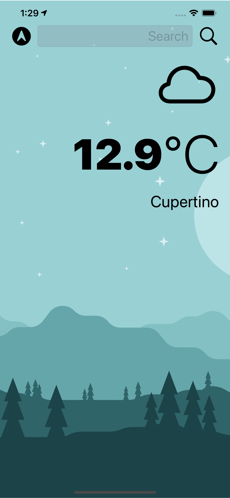
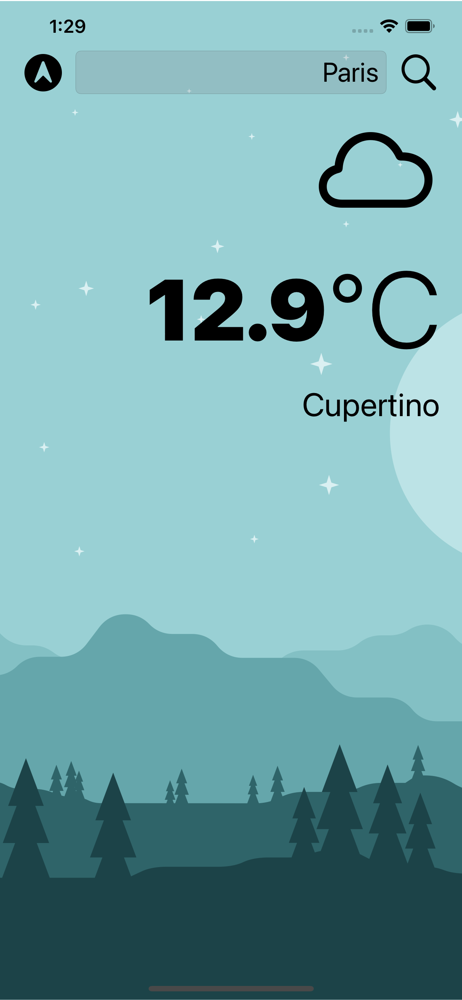
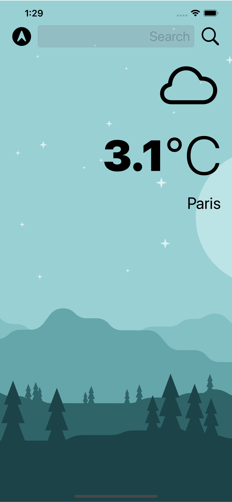
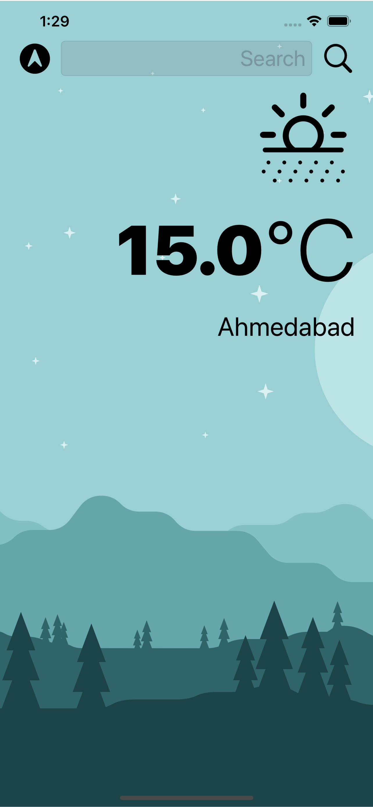
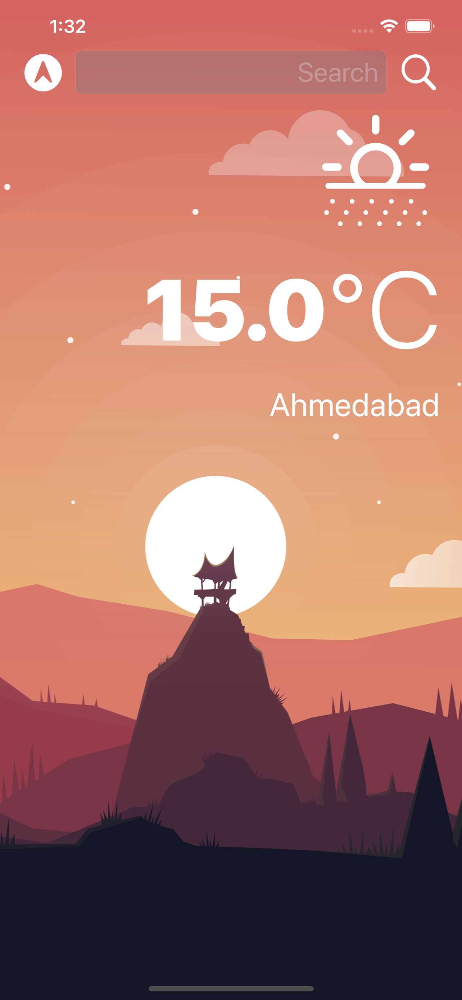
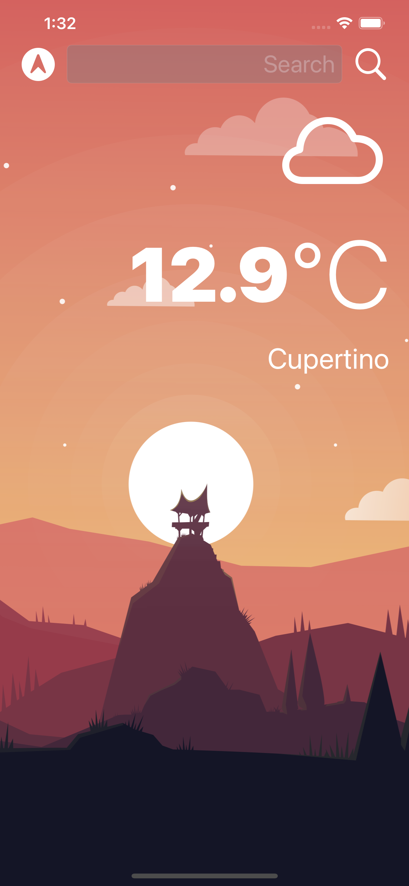

    

#  Clima

## What is it ?

* It is a beautiful, dark-mode enabled weather app implemented using Swift5 and XCode.
* Checking the weather for the current location based on the GPS data from the iPhone as well as by searching for a city manually. 
* Use of UI elements such as Labels and Buttons and changing them programmatically. 
* Use of Vector Images as Image Assets
* Use of Swift Protocols and Delegate Pattern. 
* Implementation of Swift Struct and Classes.
* Learn to use URLSession to network and make HTTP requests.
* Parse JSON with the native Encodable and Decodable protocols. 
* Learn to use Grand Central Dispatch to fetch the main thread.
* Learn to use Core Location to get the current location from the phone GPS. 

## App Screenshots

 |  (Home Screen) |  (Searched for Paris) |  (ParisWeather)|
 |:---:|:---:|:---:|
 
 | (Searched for Ahmedabad) | (Dark Mode : Ahmedabad) | (Dark Mode : Home) | 
 |:---:|:---:|:---:|

